# BobInsight - 48-Hour Hackathon Execution Plan
## IBM Bob Hackathon 2026 | May 15-17, 2026

---

## 🎯 Executive Summary

**Project**: BobInsight (Interactive Function Flow Mapper)  
**Timeline**: 72 hours (May 15, 9:00 AM - May 17, 9:00 PM)  
**Team Size**: 5 developers  
**Tech Stack**: React + Node.js/Express + React Flow + IBM Bob API  
**Demo Format**: 5-minute pitch + 5-minute live demo  

---

## 👥 Team Roles & Responsibilities

| Role | Developer | Primary Focus | Secondary Support |
|------|-----------|---------------|-------------------|
| **Dev 1** | Frontend UI/UX | Dashboard, Input Forms, Layout | Component Integration |
| **Dev 2** | Data Visualization | React Flow Graph, Node Interactions | Frontend State Management |
| **Dev 3** | Backend Engineer | API Routes, Git Operations, File Parsing | Database/Cache Layer |
| **Dev 4** | AI Integration | IBM Bob API, Prompt Engineering, JSON Validation | Backend Support |
| **Dev 5** | PM/Pitcher | Timeline Management, Pitch Deck, Business Narrative | Testing & QA |

---

## 📊 Critical Phases Overview

```mermaid
gantt
    title BobInsight 72-Hour Development Timeline
    dateFormat HH:mm
    axisFormat %H:%M
    
    section Phase 1: Foundation
    Environment Setup           :09:00, 3h
    Architecture Alignment      :09:00, 2h
    Mock Data Creation          :11:00, 2h
    
    section Phase 2: Core Build
    Backend API Development     :13:00, 8h
    Frontend Shell              :13:00, 6h
    AI Integration Start        :15:00, 6h
    
    section Phase 3: Integration
    Backend-Frontend Connect    :09:00, 6h
    Graph Rendering             :09:00, 8h
    AI Pipeline Testing         :11:00, 6h
    
    section Phase 4: Polish
    Feature Freeze              :17:00, 4h
    Bug Fixes                   :21:00, 6h
    Pitch Preparation           :09:00, 6h
    
    section Phase 5: Demo Ready
    Dry Runs                    :15:00, 3h
    Final Polish                :18:00, 2h
    Pitch Rehearsal             :20:00, 1h
```



---

## 🗓️ PHASE 1: FOUNDATION & DISCOVERY
### Day 1 (May 15) - Hours 1-12 (9:00 AM - 9:00 PM)

---

### ⏰ Hour 1-2: Kickoff & Environment Setup (9:00 AM - 11:00 AM)

#### 🎯 Milestone 0: Team Sync & Environment Ready

**Dev 1 (Frontend UI/UX)**
- [ ] Initialize React project with Vite/CRA
- [ ] Install dependencies: `react-router-dom`, `axios`, `tailwindcss`
- [ ] Set up project folder structure: `/components`, `/pages`, `/services`, `/utils`
- [ ] Create basic routing structure (Home, Dashboard, Results)
- [ ] Set up Tailwind config and global styles

**Dev 2 (Data Visualization)**
- [ ] Research React Flow documentation and examples
- [ ] Install React Flow: `npm install reactflow`
- [ ] Create `/visualization` folder structure
- [ ] Build a "Hello World" React Flow component with 3 dummy nodes
- [ ] Test node dragging, zooming, and panning functionality

**Dev 3 (Backend Engineer)**
- [ ] Initialize Node.js/Express project
- [ ] Install dependencies: `express`, `cors`, `dotenv`, `simple-git`, `axios`
- [ ] Set up folder structure: `/routes`, `/controllers`, `/services`, `/utils`
- [ ] Create basic Express server with CORS enabled (Port 5000)
- [ ] Test server with a `/health` endpoint

**Dev 4 (AI Integration)**
- [ ] Verify IBM Bob API credentials and access
- [ ] Read IBM Bob API documentation (focus on repository analysis endpoints)
- [ ] Create `/ai-services` folder
- [ ] Write a test script to ping IBM Bob API with a simple prompt
- [ ] Document API rate limits, response structure, and error codes

**Dev 5 (PM/Pitcher)**
- [ ] Create shared Google Doc for timeline tracking
- [ ] Set up hourly check-in reminders (Slack/Discord bot)
- [ ] Draft initial pitch outline (Problem → Solution → Demo → Impact)
- [ ] Create a "Risks & Fallbacks" document
- [ ] Set up a shared Figma/Miro board for architecture diagrams

**🚨 Risk Check**: If IBM Bob API is not accessible, switch to **Fallback Plan A** (use mock JSON responses).

---

### ⏰ Hour 3-4: Architecture Alignment & Mock Data (11:00 AM - 1:00 PM)

#### 🎯 Milestone 1: Mock JSON Rendering Successful

**Dev 1 (Frontend UI/UX)**
- [ ] Design and implement Repository Input Form component
  - GitHub URL input field
  - "Analyze Repository" button
  - Loading state indicator
- [ ] Create Results Page layout with placeholder sections
- [ ] Implement basic navigation between pages
- [ ] Add error boundary component for graceful error handling

**Dev 2 (Data Visualization)**
- [ ] Create mock JSON data structure for function flow graph:
  ```json
  {
    "files": [
      {
        "id": "file1",
        "name": "app.js",
        "functions": [
          {"id": "fn1", "name": "initApp", "calls": ["fn2"]},
          {"id": "fn2", "name": "setupRoutes", "calls": []}
        ]
      }
    ]
  }
  ```
- [ ] Build `GraphRenderer` component that accepts mock data
- [ ] Implement file nodes with expandable function sub-nodes
- [ ] Add edge rendering for function call relationships
- [ ] Test with 3 files, 10 functions, 15 edges

**Dev 3 (Backend Engineer)**
- [ ] Create `/api/analyze` POST endpoint (accepts GitHub URL)
- [ ] Implement basic Git clone functionality using `simple-git`
- [ ] Write file system parser to extract `.js`, `.ts`, `.py` files
- [ ] Create directory tree structure JSON response
- [ ] Test with a small public GitHub repo (e.g., Express.js hello-world)

**Dev 4 (AI Integration)**
- [ ] Design prompt template for IBM Bob API:
  ```
  Analyze this repository and extract:
  1. All function declarations
  2. Cross-file function invocations
  3. Return as JSON: {files: [{name, functions: [{name, calls: []}]}]}
  ```
- [ ] Create `bobApiService.js` with error handling and retry logic
- [ ] Implement response parser to convert Bob's output to graph JSON
- [ ] Test with a single-file code snippet first

**Dev 5 (PM/Pitcher)**
- [ ] Conduct 15-minute team standup (progress check)
- [ ] Update timeline tracker with actual vs. planned progress
- [ ] Start drafting pitch deck (Slides 1-3: Problem Statement)
- [ ] Research competitor tools (GitHub Insights, CodeSee) for differentiation
- [ ] Document "Happy Path" scenario for demo

**🎯 Checkpoint**: By 1:00 PM, Dev 2 should successfully render a mock graph with 3 files and 10 functions.

---

### ⏰ Hour 5-6: Lunch Break & Async Work (1:00 PM - 3:00 PM)

**All Developers**
- [ ] 1-hour lunch break (1:00 PM - 2:00 PM)
- [ ] Async work: Code cleanup, documentation, and self-testing (2:00 PM - 3:00 PM)

**Dev 5 (PM/Pitcher)** - Working Lunch
- [ ] Finalize Milestone 2 acceptance criteria
- [ ] Prepare demo repository (small, clean codebase with clear function flows)
- [ ] Create "Feature Freeze" checklist for Day 3

---

### ⏰ Hour 7-9: Core Backend Development (3:00 PM - 6:00 PM)

#### 🎯 Milestone 2: Backend-to-AI Pipeline Secured

**Dev 1 (Frontend UI/UX)**
- [ ] Implement loading states and progress indicators
- [ ] Create error message component with retry functionality
- [ ] Build "Repository Analysis Status" card component
- [ ] Add form validation for GitHub URL input
- [ ] Integrate with backend `/api/analyze` endpoint (mock responses for now)

**Dev 2 (Data Visualization)**
- [ ] Implement node click handler to show function details
- [ ] Create "Function Inspector Panel" (sidebar component)
- [ ] Add zoom controls and minimap to React Flow
- [ ] Implement node search/filter functionality
- [ ] Style nodes with color coding (entry points = green, leaf functions = blue)

**Dev 3 (Backend Engineer)**
- [ ] Enhance Git clone service with error handling (invalid URLs, private repos)
- [ ] Implement file content extraction and caching
- [ ] Create `/api/repository/:id/structure` endpoint for directory tree
- [ ] Build temporary file storage system (use `/tmp` or in-memory cache)
- [ ] Add request logging and performance monitoring

**Dev 4 (AI Integration)**
- [ ] Integrate IBM Bob API into backend workflow
- [ ] Create `analyzeRepository()` function that:
  1. Receives file contents from Dev 3
  2. Sends batch requests to IBM Bob API
  3. Parses responses into graph JSON format
- [ ] Implement rate limiting and request queuing
- [ ] Add fallback to cached responses if API is slow (>10 seconds)
- [ ] Test with a real repository (aim for <30 second analysis time)

**Dev 5 (PM/Pitcher)**
- [ ] Conduct 3:00 PM standup (30 minutes)
- [ ] Update risk register based on team feedback
- [ ] Continue pitch deck (Slides 4-6: Solution Architecture)
- [ ] Create demo script outline
- [ ] Test backend endpoints manually using Postman/Insomnia

**🚨 Risk Check**: If IBM Bob API latency >15 seconds, activate **Fallback Plan B** (pre-cache 3 demo repositories).

---

### ⏰ Hour 10-12: Frontend-Backend Integration (6:00 PM - 9:00 PM)

#### 🎯 Milestone 3: End-to-End Flow Working (Mock Data)

**Dev 1 (Frontend UI/UX)**
- [ ] Connect Repository Input Form to backend API
- [ ] Implement API response handling and error states
- [ ] Create "Analysis Complete" success screen
- [ ] Add navigation to Results Page after successful analysis
- [ ] Test full user flow: Input URL → Loading → Results

**Dev 2 (Data Visualization)**
- [ ] Integrate graph renderer with real backend data structure
- [ ] Implement dynamic node positioning algorithm (hierarchical layout)
- [ ] Add edge labels showing function call parameters
- [ ] Create legend component explaining node colors and edge types
- [ ] Test with backend mock data (should render correctly)

**Dev 3 (Backend Engineer)**
- [ ] Create `/api/repository/:id/graph` endpoint returning graph JSON
- [ ] Implement caching layer (store analyzed repos for 1 hour)
- [ ] Add WebSocket support for real-time analysis progress updates
- [ ] Optimize file parsing (skip `node_modules`, `.git` folders)
- [ ] Test with 3 different repository sizes (small, medium, large)

**Dev 4 (AI Integration)**
- [ ] Fine-tune IBM Bob prompts based on initial test results
- [ ] Implement JSON schema validation for API responses
- [ ] Add retry logic with exponential backoff
- [ ] Create fallback parser for malformed Bob responses
- [ ] Document API usage patterns and best practices

**Dev 5 (PM/Pitcher)**
- [ ] Conduct 6:00 PM standup (progress review)
- [ ] Test end-to-end flow and document bugs
- [ ] Update timeline: adjust Day 2 schedule based on Day 1 progress
- [ ] Continue pitch deck (Slides 7-9: Demo Preview)
- [ ] Prepare "Day 1 Retrospective" notes

**🎯 Checkpoint**: By 9:00 PM, team should successfully analyze a mock repository and render the graph.

---

### 🌙 Day 1 Evening: Wrap-up (9:00 PM - 12:00 AM)

**All Developers**
- [ ] 9:00 PM - 9:30 PM: Team retrospective (What worked? What's blocking?)
- [ ] 9:30 PM - 11:00 PM: Individual cleanup and documentation
- [ ] 11:00 PM - 12:00 AM: Wind down, prepare for sleep

**Dev 5 (PM/Pitcher)** - Extended Hours
- [ ] Finalize Day 2 task assignments
- [ ] Update shared timeline document
- [ ] Send "Day 2 Kickoff" message with priorities
- [ ] Review pitch deck progress (should be 50% complete)

**🚨 Critical Decision Point**: If Milestone 3 is NOT achieved, trigger emergency meeting to reassess scope.

---

## 🗓️ PHASE 2: CORE INTEGRATION & FEATURE BUILD
### Day 2 (May 16) - Hours 13-36 (6:00 AM - 9:00 PM)

---

### ⏰ Hour 13-15: Morning Kickoff & Live API Integration (6:00 AM - 9:00 AM)

#### 🎯 Milestone 4: Live IBM Bob API Integration Working

**Dev 1 (Frontend UI/UX)**
- [ ] Implement real-time progress updates using WebSocket
- [ ] Create "Analysis Progress" component showing:
  - Files scanned: X/Y
  - Functions extracted: Z
  - Current status message
- [ ] Add "Cancel Analysis" button
- [ ] Improve mobile responsiveness
- [ ] Fix any UI bugs from Day 1 testing

**Dev 2 (Data Visualization)**
- [ ] Implement advanced graph interactions:
  - Double-click to expand/collapse file nodes
  - Hover to highlight function call paths
  - Right-click context menu (View Code, Copy Function Name)
- [ ] Add graph export functionality (PNG, SVG)
- [ ] Implement "Focus Mode" (isolate a single function's dependencies)
- [ ] Optimize rendering performance for large graphs (>100 nodes)

**Dev 3 (Backend Engineer)**
- [ ] Switch from mock data to live IBM Bob API integration
- [ ] Implement request queuing system (max 3 concurrent API calls)
- [ ] Add comprehensive error handling for API failures
- [ ] Create `/api/repository/:id/status` endpoint for progress tracking
- [ ] Implement automatic retry for failed API calls (max 3 attempts)

**Dev 4 (AI Integration)**
- [ ] Test IBM Bob API with 5 real repositories of varying sizes
- [ ] Measure and document API response times
- [ ] Implement "Smart Chunking" (split large repos into smaller batches)
- [ ] Create fallback logic: if API fails, use local AST parser (basic)
- [ ] Build confidence scoring system for API results (accuracy indicator)

**Dev 5 (PM/Pitcher)**
- [ ] 6:00 AM standup (15 minutes)
- [ ] Test live API integration and document issues
- [ ] Continue pitch deck (Slides 10-12: Technical Architecture)
- [ ] Create demo video script
- [ ] Research judging criteria and tailor pitch accordingly

**🚨 Risk Check**: If IBM Bob API success rate <80%, immediately implement **Fallback Plan C** (hybrid: API + local parser).

---

### ⏰ Hour 16-18: Feature Enhancement (9:00 AM - 12:00 PM)

#### 🎯 Milestone 5: Interactive Inspector Panel Complete

**Dev 1 (Frontend UI/UX)**
- [ ] Build "Function Inspector Panel" with tabs:
  - **Overview**: Function name, file location, line numbers
  - **Dependencies**: Functions it calls (outgoing edges)
  - **Dependents**: Functions that call it (incoming edges)
  - **Code Preview**: Syntax-highlighted code snippet
- [ ] Add "Copy to Clipboard" functionality
- [ ] Implement panel animations (slide in/out)
- [ ] Add keyboard shortcuts (Esc to close, Arrow keys to navigate)

**Dev 2 (Data Visualization)**
- [ ] Implement graph layout algorithms:
  - Hierarchical (top-down flow)
  - Force-directed (organic clustering)
  - Circular (radial layout)
- [ ] Add layout switcher in UI
- [ ] Implement "Path Highlighting" (show execution flow from entry point)
- [ ] Create "Complexity Heatmap" (color nodes by cyclomatic complexity)
- [ ] Add animation for graph transitions

**Dev 3 (Backend Engineer)**
- [ ] Implement code snippet extraction for Function Inspector
- [ ] Add syntax highlighting support (use `highlight.js`)
- [ ] Create `/api/function/:id/details` endpoint
- [ ] Implement security scanning (flag potential vulnerabilities)
- [ ] Add performance metrics (function execution time estimates)

**Dev 4 (AI Integration)**
- [ ] Enhance IBM Bob prompts to extract:
  - Function complexity scores
  - Security risk indicators
  - Performance bottlenecks
- [ ] Implement "Explain Function" feature (natural language description)
- [ ] Add caching for frequently analyzed repositories
- [ ] Create "Diff Analysis" (compare two versions of a repo)

**Dev 5 (PM/Pitcher)**
- [ ] 9:00 AM standup (30 minutes)
- [ ] Test all new features and create bug list
- [ ] Continue pitch deck (Slides 13-15: Business Value)
- [ ] Draft demo repository selection (choose 2-3 impressive examples)
- [ ] Create "Feature Freeze" checklist for 5:00 PM

**🎯 Checkpoint**: By 12:00 PM, Function Inspector Panel should display real data from IBM Bob API.

---

### ⏰ Hour 19-21: Lunch Break & Polish (12:00 PM - 3:00 PM)

**All Developers**
- [ ] 12:00 PM - 1:00 PM: Lunch break
- [ ] 1:00 PM - 3:00 PM: Bug fixes and code cleanup

**Dev 5 (PM/Pitcher)** - Working Lunch
- [ ] Prepare "Feature Freeze" announcement
- [ ] Create Day 3 schedule (focus on polish and pitch)
- [ ] Test demo flow and identify weak points

---

### ⏰ Hour 22-24: Integration Testing & Bug Fixes (3:00 PM - 6:00 PM)

#### 🎯 Milestone 6: All Core Features Integrated

**Dev 1 (Frontend UI/UX)**
- [ ] Conduct full UI/UX review
- [ ] Fix responsive design issues
- [ ] Improve loading states and animations
- [ ] Add tooltips and help text
- [ ] Implement dark mode toggle (bonus feature)

**Dev 2 (Data Visualization)**
- [ ] Performance optimization for large graphs
- [ ] Fix edge rendering issues
- [ ] Improve node label readability
- [ ] Add graph statistics panel (total nodes, edges, depth)
- [ ] Test with 10 different repositories

**Dev 3 (Backend Engineer)**
- [ ] Load testing (simulate 10 concurrent users)
- [ ] Fix memory leaks and optimize caching
- [ ] Improve error messages and logging
- [ ] Add API rate limiting
- [ ] Create health check dashboard

**Dev 4 (AI Integration)**
- [ ] Test IBM Bob API with edge cases (empty repos, single-file repos, huge repos)
- [ ] Implement graceful degradation for API failures
- [ ] Optimize prompt engineering for faster responses
- [ ] Add telemetry and usage analytics
- [ ] Document API limitations and workarounds

**Dev 5 (PM/Pitcher)**
- [ ] 3:00 PM standup (integration review)
- [ ] Coordinate bug fix priorities
- [ ] Continue pitch deck (Slides 16-18: Market Opportunity)
- [ ] Create demo checklist
- [ ] Test full demo flow (should take <5 minutes)

---

### ⏰ Hour 25-27: Feature Freeze & Stabilization (6:00 PM - 9:00 PM)

#### 🎯 Milestone 7: Feature Freeze - No New Features

**All Developers**
- [ ] **6:00 PM: FEATURE FREEZE ANNOUNCEMENT**
- [ ] Focus exclusively on bug fixes and stability
- [ ] No new features or major refactoring
- [ ] Prioritize demo-critical bugs only

**Dev 1 (Frontend UI/UX)**
- [ ] Fix top 5 UI bugs from bug list
- [ ] Improve error handling and user feedback
- [ ] Add loading skeletons for better perceived performance
- [ ] Test on different browsers (Chrome, Firefox, Safari)
- [ ] Create user guide (1-page quick start)

**Dev 2 (Data Visualization)**
- [ ] Fix graph rendering bugs
- [ ] Optimize performance (target: <2 seconds to render 100 nodes)
- [ ] Improve edge routing (avoid overlaps)
- [ ] Add graph export quality settings
- [ ] Test with demo repositories

**Dev 3 (Backend Engineer)**
- [ ] Fix critical backend bugs
- [ ] Improve API response times (target: <5 seconds for small repos)
- [ ] Add comprehensive logging
- [ ] Implement graceful shutdown
- [ ] Create deployment checklist

**Dev 4 (AI Integration)**
- [ ] Fix IBM Bob API integration issues
- [ ] Implement final fallback strategy
- [ ] Test with all demo repositories
- [ ] Document API usage and costs
- [ ] Create "API Troubleshooting Guide"

**Dev 5 (PM/Pitcher)**
- [ ] 6:00 PM standup (feature freeze review)
- [ ] Finalize pitch deck (Slides 19-20: Call to Action)
- [ ] Create demo script with timing
- [ ] Prepare backup demo (pre-recorded video)
- [ ] Schedule Day 3 dry runs

**🎯 Checkpoint**: By 9:00 PM, application should be stable with no critical bugs.

---

### 🌙 Day 2 Evening: Final Integration (9:00 PM - 12:00 AM)

**All Developers**
- [ ] 9:00 PM - 9:30 PM: Team retrospective
- [ ] 9:30 PM - 11:00 PM: Final bug fixes and testing
- [ ] 11:00 PM - 12:00 AM: Code freeze and documentation

**Dev 5 (PM/Pitcher)** - Extended Hours
- [ ] Finalize Day 3 schedule (focus on pitch and demo)
- [ ] Review pitch deck (should be 90% complete)
- [ ] Create "Demo Day Checklist"
- [ ] Prepare contingency plans for demo failures

---

## 🗓️ PHASE 3: POLISH & PITCH PREPARATION
### Day 3 (May 17) - Hours 37-72 (6:00 AM - 9:00 PM)

---

### ⏰ Hour 37-39: Morning Polish (6:00 AM - 9:00 AM)

#### 🎯 Milestone 8: Demo-Ready Application

**Dev 1 (Frontend UI/UX)**
- [ ] Final UI polish (spacing, colors, fonts)
- [ ] Add BobInsight branding (logo, color scheme)
- [ ] Improve accessibility (ARIA labels, keyboard navigation)
- [ ] Test on demo laptop/screen
- [ ] Create "Demo Mode" (pre-loaded examples)

**Dev 2 (Data Visualization)**
- [ ] Final graph polish (smooth animations, clean layouts)
- [ ] Add "Wow Factor" features (particle effects, smooth transitions)
- [ ] Test graph with demo repositories
- [ ] Create impressive demo scenarios
- [ ] Prepare graph screenshots for pitch deck

**Dev 3 (Backend Engineer)**
- [ ] Final performance optimization
- [ ] Deploy to production server (Heroku, Vercel, or AWS)
- [ ] Set up monitoring and alerts
- [ ] Test production deployment
- [ ] Create rollback plan

**Dev 4 (AI Integration)**
- [ ] Final IBM Bob API testing
- [ ] Verify fallback mechanisms
- [ ] Pre-cache demo repositories
- [ ] Test API rate limits
- [ ] Prepare API usage report

**Dev 5 (PM/Pitcher)**
- [ ] 6:00 AM standup (final day kickoff)
- [ ] Finalize pitch deck (100% complete)
- [ ] Create demo script with exact timing
- [ ] Prepare speaker notes
- [ ] Test pitch delivery (solo practice)

---

### ⏰ Hour 40-42: Deployment & Testing (9:00 AM - 12:00 PM)

#### 🎯 Milestone 9: Production Deployment Complete

**Dev 1 (Frontend UI/UX)**
- [ ] Deploy frontend to production
- [ ] Test production URL on multiple devices
- [ ] Fix any deployment-specific issues
- [ ] Create "Demo Checklist" (URLs, credentials, test data)
- [ ] Prepare backup demo environment

**Dev 2 (Data Visualization)**
- [ ] Test graph rendering in production
- [ ] Verify all interactions work correctly
- [ ] Create demo walkthrough video (backup)
- [ ] Prepare graph screenshots for pitch
- [ ] Test on presentation laptop

**Dev 3 (Backend Engineer)**
- [ ] Monitor production deployment
- [ ] Test all API endpoints in production
- [ ] Verify database/cache connections
- [ ] Set up error tracking (Sentry, LogRocket)
- [ ] Create "Production Troubleshooting Guide"

**Dev 4 (AI Integration)**
- [ ] Test IBM Bob API in production
- [ ] Verify all demo repositories work
- [ ] Monitor API usage and costs
- [ ] Prepare API performance metrics for pitch
- [ ] Create "API Failure Response Plan"

**Dev 5 (PM/Pitcher)**
- [ ] 9:00 AM standup (deployment review)
- [ ] Test full demo flow in production
- [ ] Time demo (should be exactly 5 minutes)
- [ ] Prepare Q&A responses
- [ ] Create "Demo Day Emergency Contacts" list

**🎯 Checkpoint**: By 12:00 PM, production deployment should be stable and demo-ready.

---

### ⏰ Hour 43-45: Lunch & Pitch Rehearsal (12:00 PM - 3:00 PM)

**All Developers**
- [ ] 12:00 PM - 1:00 PM: Lunch break
- [ ] 1:00 PM - 3:00 PM: Full team pitch rehearsal

**Dev 5 (PM/Pitcher)** - Leading Rehearsal
- [ ] Conduct full pitch rehearsal (5 minutes pitch + 5 minutes demo)
- [ ] Time each section precisely
- [ ] Get feedback from team
- [ ] Refine transitions and talking points
- [ ] Practice Q&A responses

**All Developers** - Rehearsal Roles
- [ ] Dev 1: Backup presenter (in case Dev 5 is unavailable)
- [ ] Dev 2: Demo operator (controls screen during demo)
- [ ] Dev 3: Technical support (monitors backend during demo)
- [ ] Dev 4: Q&A support (answers technical questions)
- [ ] Dev 5: Primary presenter

---

### ⏰ Hour 46-48: Dry Run #1 (3:00 PM - 6:00 PM)

#### 🎯 Milestone 10: First Complete Dry Run

**All Developers**
- [ ] 3:00 PM: Full dry run with external observers (friends, mentors)
- [ ] Present pitch deck (5 minutes)
- [ ] Perform live demo (5 minutes)
- [ ] Answer Q&A (5 minutes)
- [ ] Collect feedback and identify improvements

**Dev 5 (PM/Pitcher)**
- [ ] Lead dry run
- [ ] Document feedback
- [ ] Identify weak points in pitch
- [ ] Refine demo script based on feedback
- [ ] Update pitch deck if needed

**Dev 1-4 (Support Team)**
- [ ] Monitor demo for technical issues
- [ ] Take notes on audience reactions
- [ ] Prepare answers to common questions
- [ ] Identify potential demo failures
- [ ] Create mitigation strategies

**🚨 Risk Check**: If dry run reveals major issues, allocate 2 hours for emergency fixes.

---

### ⏰ Hour 49-51: Refinement & Polish (6:00 PM - 9:00 PM)

**All Developers**
- [ ] Implement feedback from Dry Run #1
- [ ] Fix any issues discovered during rehearsal
- [ ] Polish pitch deck based on feedback
- [ ] Refine demo flow for better impact
- [ ] Practice individual sections

**Dev 5 (PM/Pitcher)**
- [ ] Refine pitch narrative
- [ ] Improve slide transitions
- [ ] Practice vocal delivery and pacing
- [ ] Prepare backup slides (for Q&A)
- [ ] Create "Pitch Day Checklist"

**Dev 1-4 (Support Team)**
- [ ] Fix any demo bugs discovered
- [ ] Improve demo visual appeal
- [ ] Prepare demo backup plan
- [ ] Test all demo scenarios
- [ ] Create "Demo Failure Recovery Plan"

---

### 🌙 Day 3 Evening: Final Preparation (9:00 PM - 12:00 AM)

**All Developers**
- [ ] 9:00 PM - 9:30 PM: Team dinner and relaxation
- [ ] 9:30 PM - 10:30 PM: Final pitch rehearsal
- [ ] 10:30 PM - 11:00 PM: Equipment check (laptop, cables, backup devices)
- [ ] 11:00 PM - 12:00 AM: Rest and mental preparation

**Dev 5 (PM/Pitcher)**
- [ ] Final pitch deck review
- [ ] Print speaker notes
- [ ] Prepare demo laptop
- [ ] Test presentation equipment
- [ ] Get good sleep (critical for demo day!)

---

## 🗓️ PHASE 4: DEMO DAY
### Day 3 (May 17) - Final Hours (6:00 AM - 9:00 PM)

---

### ⏰ Hour 52-54: Morning Preparation (6:00 AM - 9:00 AM)

**All Developers**
- [ ] 6:00 AM: Wake up and breakfast
- [ ] 7:00 AM: Team meeting (final pep talk)
- [ ] 7:30 AM: Equipment check and setup
- [ ] 8:00 AM: Arrive at venue early
- [ ] 8:30 AM: Test presentation equipment at venue

**Dev 5 (PM/Pitcher)**
- [ ] Review pitch notes one final time
- [ ] Test microphone and presentation clicker
- [ ] Verify demo laptop is working
- [ ] Check internet connection
- [ ] Warm up voice and practice opening lines

**Dev 2 (Demo Operator)**
- [ ] Set up demo laptop
- [ ] Test all demo scenarios
- [ ] Verify production URL is accessible
- [ ] Prepare backup demo (pre-recorded video)
- [ ] Test screen sharing/projection

---

### ⏰ Hour 55-57: Dry Run #2 (9:00 AM - 12:00 PM)

#### 🎯 Milestone 11: Final Dry Run at Venue

**All Developers**
- [ ] 9:00 AM: Full dry run at venue
- [ ] Test presentation equipment
- [ ] Practice with actual stage setup
- [ ] Time the pitch precisely
- [ ] Identify any venue-specific issues

**Dev 5 (PM/Pitcher)**
- [ ] Practice with venue microphone
- [ ] Test stage presence and movement
- [ ] Verify slide visibility from audience
- [ ] Practice Q&A with team
- [ ] Final confidence check

---

### ⏰ Hour 58-60: Final Adjustments (12:00 PM - 3:00 PM)

**All Developers**
- [ ] 12:00 PM - 1:00 PM: Lunch break (light meal)
- [ ] 1:00 PM - 2:00 PM: Final adjustments based on Dry Run #2
- [ ] 2:00 PM - 3:00 PM: Relaxation and mental preparation

**Dev 5 (PM/Pitcher)**
- [ ] Make final pitch deck adjustments
- [ ] Review Q&A responses
- [ ] Practice opening and closing statements
- [ ] Visualize successful presentation
- [ ] Stay calm and confident

---

### ⏰ Hour 61-63: Pre-Presentation (3:00 PM - 6:00 PM)

**All Developers**
- [ ] 3:00 PM: Attend other team presentations (learn from competitors)
- [ ] 4:00 PM: Final team huddle (motivation and strategy)
- [ ] 5:00 PM: Equipment final check
- [ ] 5:30 PM: Get into presentation mindset

**Dev 5 (PM/Pitcher)**
- [ ] Watch other presentations for inspiration
- [ ] Note judge reactions and preferences
- [ ] Adjust pitch strategy if needed
- [ ] Stay hydrated and energized
- [ ] Final mental preparation

---

### ⏰ Hour 64-66: SHOWTIME (6:00 PM - 9:00 PM)

#### 🎯 Milestone 12: PITCH & DEMO DELIVERY

**6:00 PM - 6:05 PM: Pitch Presentation**
- [ ] **Slide 1-2**: Problem Statement (30 seconds)
  - "Onboarding developers to legacy codebases takes weeks"
  - "Traditional tools show folders, not logic flows"
- [ ] **Slide 3-5**: Solution Introduction (45 seconds)
  - "BobInsight: X-Ray vision for source code"
  - "Powered by IBM Bob API's full repository context"
- [ ] **Slide 6-8**: Technical Architecture (45 seconds)
  - "React + Node.js + React Flow + IBM Bob API"
  - "Automated function-level dependency mapping"
- [ ] **Slide 9-10**: Market Opportunity (30 seconds)
  - "Enterprise developer tools market: $10B+"
  - "Target: Fortune 500 engineering teams"
- [ ] **Slide 11-12**: Call to Action (30 seconds)
  - "Join us in revolutionizing code comprehension"
  - "Demo time!"

**6:05 PM - 6:10 PM: Live Demo**
- [ ] **Minute 1**: Show landing page and input GitHub URL
- [ ] **Minute 2**: Demonstrate real-time analysis progress
- [ ] **Minute 3**: Reveal interactive function flow graph
- [ ] **Minute 4**: Click on function, show Inspector Panel
- [ ] **Minute 5**: Highlight key features (path tracing, complexity heatmap)

**6:10 PM - 6:15 PM: Q&A**
- [ ] Answer judge questions confidently
- [ ] Demonstrate technical depth
- [ ] Highlight IBM Bob API integration
- [ ] Emphasize business value

**Post-Presentation**
- [ ] Thank judges and audience
- [ ] Network with other teams
- [ ] Celebrate team effort
- [ ] Wait for results

---

## 🚨 RISK MANAGEMENT & FALLBACK STRATEGIES

### Risk Matrix

| Risk | Probability | Impact | Mitigation Strategy |
|------|-------------|--------|---------------------|
| IBM Bob API Downtime | Medium | High | **Fallback Plan A**: Use pre-cached mock responses |
| IBM Bob API Slow Response (>15s) | High | Medium | **Fallback Plan B**: Pre-cache 3 demo repositories |
| Frontend-Backend Integration Issues | Medium | High | Use mock data until integration is stable |
| Graph Rendering Performance Issues | Medium | Medium | Limit graph to 100 nodes, implement pagination |
| Demo Laptop Failure | Low | Critical | **Fallback Plan C**: Backup laptop + pre-recorded video |
| Internet Connection Failure | Low | Critical | **Fallback Plan D**: Local demo environment + video |
| Team Member Unavailable | Low | High | Cross-train team members on each other's roles |

---

### Fallback Plan A: Mock JSON Responses
**Trigger**: IBM Bob API is completely inaccessible  
**Action**:
1. Dev 4 creates comprehensive mock JSON responses for 5 demo repositories
2. Backend serves mock data instead of calling IBM Bob API
3. Add disclaimer in pitch: "Demo uses simulated data due to API access"
4. Focus pitch on visualization and UX innovation

---

### Fallback Plan B: Pre-Cached Demo Repositories
**Trigger**: IBM Bob API response time >15 seconds  
**Action**:
1. Dev 4 pre-analyzes 3 impressive repositories during Day 2
2. Store results in backend cache
3. Demo uses cached results for instant visualization
4. Mention in pitch: "Pre-analyzed for demo speed, live analysis available"

---

### Fallback Plan C: Hybrid Approach (API + Local Parser)
**Trigger**: IBM Bob API success rate <80%  
**Action**:
1. Dev 4 implements basic local AST parser (using `@babel/parser` for JS)
2. Use IBM Bob API for complex analysis, local parser for simple cases
3. Combine results for best accuracy
4. Highlight "Intelligent Fallback System" as a feature

---

### Fallback Plan D: Pre-Recorded Demo Video
**Trigger**: Critical demo failure (laptop crash, internet down)  
**Action**:
1. Dev 2 creates high-quality demo video during Day 3 morning
2. Upload to YouTube (unlisted) as backup
3. If live demo fails, play video while narrating
4. Apologize briefly, continue with confidence

---

## 📋 CRITICAL MILESTONES CHECKLIST

### ✅ Milestone 0: Team Sync & Environment Ready (Hour 2)
- [ ] All development environments set up
- [ ] Basic project structure created
- [ ] Team communication channels active

### ✅ Milestone 1: Mock JSON Rendering Successful (Hour 4)
- [ ] React Flow renders 3 files, 10 functions, 15 edges
- [ ] Basic node interactions working (drag, zoom, pan)

### ✅ Milestone 2: Backend-to-AI Pipeline Secured (Hour 9)
- [ ] Backend can clone GitHub repositories
- [ ] IBM Bob API integration working (even with mock data)
- [ ] Basic graph JSON structure defined

### ✅ Milestone 3: End-to-End Flow Working (Hour 12)
- [ ] User can input GitHub URL
- [ ] Backend processes request
- [ ] Frontend displays graph (mock data acceptable)

### ✅ Milestone 4: Live IBM Bob API Integration Working (Hour 15)
- [ ] Real repositories analyzed using IBM Bob API
- [ ] Function dependencies extracted correctly
- [ ] Graph displays real data

### ✅ Milestone 5: Interactive Inspector Panel Complete (Hour 18)
- [ ] Clicking function shows detailed information
- [ ] Code preview with syntax highlighting
- [ ] Dependency visualization

### ✅ Milestone 6: All Core Features Integrated (Hour 24)
- [ ] All frontend and backend components connected
- [ ] No critical bugs
- [ ] Demo flow works end-to-end

### ✅ Milestone 7: Feature Freeze (Hour 27)
- [ ] No new features added after this point
- [ ] Focus on stability and polish only

### ✅ Milestone 8: Demo-Ready Application (Hour 39)
- [ ] Application is stable and polished
- [ ] Demo scenarios tested and working
- [ ] Backup plans in place

### ✅ Milestone 9: Production Deployment Complete (Hour 42)
- [ ] Application deployed to production
- [ ] All features working in production environment
- [ ] Monitoring and error tracking active

### ✅ Milestone 10: First Complete Dry Run (Hour 48)
- [ ] Full pitch and demo rehearsed
- [ ] Feedback collected and documented
- [ ] Improvements identified

### ✅ Milestone 11: Final Dry Run at Venue (Hour 57)
- [ ] Pitch and demo tested at actual venue
- [ ] Equipment verified working
- [ ] Team confident and ready

### ✅ Milestone 12: PITCH & DEMO DELIVERY (Hour 66)
- [ ] Pitch delivered successfully
- [ ] Demo executed flawlessly
- [ ] Q&A handled confidently

---

## 🎯 SUCCESS CRITERIA

### Technical Success
- [ ] Application successfully analyzes at least 3 different repositories
- [ ] Graph renders within 5 seconds for repositories with <50 files
- [ ] IBM Bob API integration works with >90% success rate
- [ ] No critical bugs during demo
- [ ] Application is accessible via public URL

### Demo Success
- [ ] Pitch delivered within 5-minute time limit
- [ ] Demo completed within 5-minute time limit
- [ ] All key features demonstrated successfully
- [ ] Q&A handled confidently
- [ ] Judges understand the value proposition

### Team Success
- [ ] All team members contribute meaningfully
- [ ] No major conflicts or blockers
- [ ] Team morale remains high throughout
- [ ] Learning objectives achieved
- [ ] Proud of final product

---

## 📞 EMERGENCY CONTACTS & RESOURCES

### Team Communication
- **Primary**: Slack/Discord channel
- **Backup**: WhatsApp group
- **Emergency**: Phone numbers shared privately

### Technical Support
- **IBM Bob API Support**: [API documentation URL]
- **Hackathon Mentors**: Available at venue
- **Stack Overflow**: For quick technical questions

### Venue Information
- **Location**: [Venue address]
- **WiFi**: [Network name and password]
- **Presentation Time**: [Scheduled time slot]
- **Equipment**: Projector, microphone, screen

---

## 🎉 POST-HACKATHON PLAN

### Immediate (Day 4)
- [ ] Team retrospective (What went well? What could improve?)
- [ ] Collect judge feedback
- [ ] Take team photo with project
- [ ] Celebrate achievements (win or learn!)

### Short-term (Week 1)
- [ ] Clean up codebase and add documentation
- [ ] Create GitHub repository (public or private)
- [ ] Write blog post about experience
- [ ] Share on LinkedIn and social media

### Long-term (Month 1)
- [ ] Consider continuing development
- [ ] Explore commercialization opportunities
- [ ] Apply learnings to future projects
- [ ] Stay connected as a team

---

## 💡 FINAL TIPS FOR SUCCESS

### For Dev 1 (Frontend UI/UX)
- Keep UI simple and clean - less is more
- Focus on user experience over fancy animations
- Test on multiple screen sizes early
- Use a design system (Material-UI, Ant Design) to save time

### For Dev 2 (Data Visualization)
- Start with basic graph, add complexity gradually
- Performance is critical - optimize early
- Use React Flow's built-in features before custom solutions
- Create impressive demo scenarios

### For Dev 3 (Backend Engineer)
- Error handling is more important than features
- Cache aggressively to improve performance
- Monitor API usage and costs
- Keep backend simple and focused

### For Dev 4 (AI Integration)
- Test IBM Bob API early and often
- Have fallback plans ready
- Document API quirks and limitations
- Focus on prompt engineering for best results

### For Dev 5 (PM/Pitcher)
- Keep team motivated and focused
- Communicate clearly and frequently
- Practice pitch until it's second nature
- Stay calm under pressure

### For Everyone
- **Sleep is not optional** - 6 hours minimum per night
- **Communicate constantly** - over-communication is better than under-communication
- **Stay flexible** - plans will change, adapt quickly
- **Have fun** - this is a learning experience, enjoy the journey!
- **Support each other** - teamwork makes the dream work

---

## 🏆 WINNING MINDSET

Remember:
- **Focus on impact, not perfection** - A working demo beats perfect code
- **Tell a story** - Judges remember narratives, not features
- **Show, don't tell** - Live demo is worth 1000 slides
- **Be confident** - You've worked hard, own your achievement
- **Learn and grow** - Win or lose, you've gained valuable experience

**Good luck, Team BobInsight! You've got this! 🚀**

---

*This execution plan is a living document. Adjust as needed based on actual progress and challenges encountered. The key to hackathon success is adaptability, teamwork, and relentless focus on delivering a working demo.*